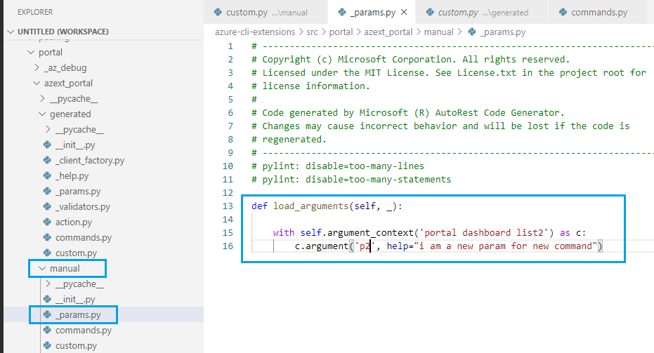

# Manual Customizations

## How to override a command's implementation:

* Figure out the implementation method to override in **...\generated\command.py** and **...\generated\custom.py** as below:


* Add **custom.py** file in **manual** folder if it's not exist and provide your implementation as below:


## How to add more argument into a command

* Add **_params.py** file in **manual** folder if it's not exist and add your new argument as below:

* Figure out the implementation method to override in **...\generated\command.py** and **...\generated\custom.py** as below:


* Add **custom.py** file in **manual** folder if it's not exist and provide your implementation as below:


## How to add a new command

* Add **command.py** file in **manual** folder if it's not exist and provide your new command as below. You can take **...\generated\command.py** as a reference.

* Add **_params.py** file in **manual** folder if it's not exist and provide the arguments for your new command. You can take **...\generated\_params.py** as a reference.

* add **custom.py** file in **manual** folder if it's not exist and provide the implementation for your new command


## Overriding Actions

It's also possible to override actions or add any new actions by adding **actions.py** file in **manual** folder.

## Overriding Version

If you want to override version. you just need to put **version.py** in the **manual** folder. and have this line in it.  
```
VERSION = "your-actual-version"
```

