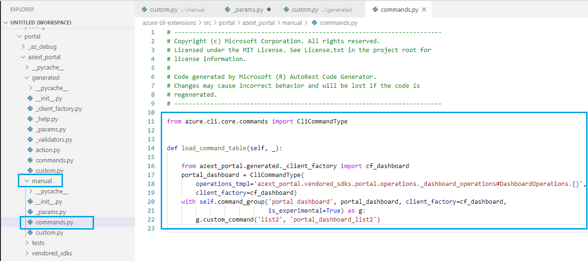

# Manual Customizations

## How to override a command's implementation:

* Figure out the implementation method to override in **...\generated\command.py** and **...\generated\custom.py** as below:


* Add **custom.py** file in **manual** folder if it's not exist and provide your implementation as below:


## How to add more argument into a command

* Add **_params.py** file in **manual** folder if it's not exist and add your new argument as below:

* Figure out the implementation method to override in **...\generated\command.py** and **...\generated\custom.py** as below:


* Add **custom.py** file in **manual** folder if it's not exist and provide your implementation as below:


## How to add a new command

* Add **command.py** file in **manual** folder if it's not exist and provide your new command as below. You can take **...\generated\command.py** as a reference.

* Add **_params.py** file in **manual** folder if it's not exist and provide the arguments for your new command. You can take **...\generated\_params.py** as a reference.

* add **custom.py** file in **manual** folder if it's not exist and provide the implementation for your new command


## How to add a new command group
* Add **...\manual\command.py** file if it's not exist and provide your new command group and its commands as below. The client_factory is optional and is needed when you want to use the special arguments such as `cmd`. You can take **...\generated\command.py** as a reference.
```python
def load_command_table(self, _):

    from azext_ml.generated._client_factory import cf_ml_cl
    with self.command_group('portal newgroup', client_factory=cf_ml_cl) as g:
        g.custom_command('create', 'newgroup_create')
        g.custom_command('update', 'newgroup_show')
        g.custom_command('delete', 'newgroup_delete')
``` 
* Add **...\manual\custom.py** file if it's not exist and implement your new command. You can take **...\generated\custom.py** as a reference.
```python
def newgroup_create(cmd, arg0, arg1, ...):
    ...
def newgroup_show(cmd, arg0, arg1, ...):
    ...
def newgroup_delete(cmd, arg0, arg1, ...):
    ...
```
* As above, you can add or edit **...\manual\\_params.py** file to implement arguments for your new commands. 
* Make sure you can run these commands in the terminal of your choice:
```bash
az portal newgroup create
```

## Overriding Actions

It's also possible to override actions or add any new actions by adding **actions.py** file in **manual** folder.

## Overriding Version

If you want to override version. you just need to put **version.py** in the **manual** folder. and have this line in it.  
```
VERSION = "your-actual-version"
```

