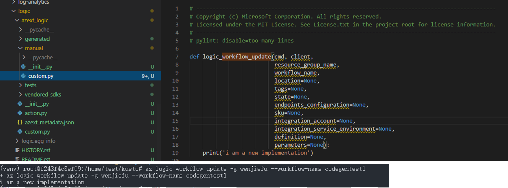

# FAQ

## Where to add the customization for CodeGen
Configuration can be put in either *xxx.cli.md* or *xxx.az.md* in *Azure/azure-rest-api-specs* repo to do custumization:

* xxx.cli.md: the customization will be applied to all CLI languages (i.e. azure cli, powershell ...)
* xxx.az.md: the customization will only be applied to azure cli
> Example can be found at [here](https://github.com/Azure/azure-rest-api-specs/tree/master/specification/logic/resource-manager)


## How to install the codegen extension from the swagger pipeline
* Please install the latest Azure CLI and try this.
``` yaml
az extension add --source=<cli-extension-whl-link-from-swagger-pipeline>
```

## what would the clear-output-folder clear
* Instead of using --output-folder in the command line to specify which folder you want the extension to be generated. we use --azure-cli-extension-folder=path-to-local-azure-cli-extensions-repo now. 
* the clear-output-folder would clear everything under path-to-local-azure-cli-extensions-repo/src/extension-name except the manual folder which is path-to-local-azure-cli-extensions-repo/src/extension-name/azext_extension_name/manual now.


## How to add/remove subgroup 
* we can add or remove subgroup by using directive
* Let's say we want to
* Remove subgroup:
> For example: to remove the `share` subgroup and change the command from  
>   `az datashare share --argument value`  
>   into  
>   `az datashare --argument value`  
* Add subgroup:  
> For example: to add `trigger` subgroup into the `consumer` subgroup and change the command from  
>   `az datashare trigger --argument value`   
>   into  
>   `az datashare consumer trigger --argument value`  
>   here the subgroup `consumer` does not have to be pre-exist.
* we should add below configuration in to readme.az.md to make it work.
``` yaml
directive:
    - where:
          group: datashare share
      set:
          group: datashare
    - where:
          group: datashare trigger
      set:
          group: datashare consumer trigger
```

* RegExp support 
> In the case above. if you have two subgroup `datashare share` `datashare share-subscription` and  
> you only want to remove the `share` subgroup and keep the `share-subscription` subgroup.  
> You can use the following configuration
``` yaml
directive:
  - where:
      group: ^datashare share$
    set:
      group: datashare
```

## How to hide an operation, operationGroup, parameter

Example:
``` yaml
cli:
  cli-directive:
    - where:
        group: 'GroupNameOrRegex'
        op: 'OperationNameOrRegex'
        param: 'paramNameOrRegex'
      hidden: true
    - where:
        group: 'GroupNameOrRegex'
        op: 'OperationNameOrRegex'
      hidden: true
    - where:
        group: 'GroupNameOrRegex'
      hidden: true
```
Check [here](https://github.com/Azure/autorest.clicommon/blob/master/doc/cli-directive.md) for how to figure out the names to use in cli-directive

> Warning: when you want to hide a required parameter, please make sure the default value is provided for the parameter in swagger. We are working on the support for you to provide a default value through directive now

## Why my parameter/properties defined in swagger doesn't appear

The parameter/properties will be ignored by default if it's:
* readonly
* Const
* Enum with only one possible value
* hidden

## How to mark a parameter as required

Example:
``` yaml
cli:
  cli-directive:
    - where:
        group: 'GroupNameOrRegex'
        op: 'OperationNameOrRegex'
        param: 'paramNameOrRegex'
      required: true
    - where:
        group: 'GroupNameOrRegex'
        op: 'OperationNameOrRegex'
      required: true
    - where:
        group: 'GroupNameOrRegex'
      required: true
```
Check [here](https://github.com/Azure/autorest.clicommon/blob/master/doc/cli-directive.md) for how to figure out the names to use in cli-directive

## How to rename a parameter, operation or operationGroup

There are two ways to rename a parameter:

#### Option 1: using cli directive 

This is supported in both xxx.cli.md and xxx.az.md

Example:
``` yaml
cli:
  cli-directive:
    - where:
        group: 'GroupNameOrRegex'
        op: 'OperationNameOrRegex'
        param: 'paramNameOrRegex'
      name: 'new_name_in_snake_naming_convention'
    - where:
        group: 'GroupNameOrRegex'
        op: 'OperationNameOrRegex'
      name: 'new_name_in_snake_naming_convention'
    - where:
        group: 'GroupNameOrRegex'
      name: 'new_name_in_snake_naming_convention'
```
Check [here](https://github.com/Azure/autorest.clicommon/blob/master/doc/cli-directive.md) for how to figure out the names to use in cli-directive

#### Option 2: using az directive

this is only supported in xxx.az.md, details can be found at [here](02-customizations.md)

## How to set the help message of parameter, operation, group

Please update your description in swagger in this case

## How to do manual override

Detail can be found at [here](03-manual-customizations.md)

Example:


## How to do manual override for test

Detail can be found at [here](04-scenario-test-configuration.md)

## How to force to use Json for parmaeter

Example:
``` yaml
cli:
  cli-directive:
    - where:
        group: 'GroupNameOrRegex'
        op: 'OperationNameOrRegex'
        param: 'paramNameOrRegex'
      json: true
    - where:
        type: 'typeNameOrRegex'
        prop: 'propertyNameOrRegex'
      json: true
```
Check [here](https://github.com/Azure/autorest.clicommon/blob/master/doc/cli-directive.md) for how to figure out the names to use in cli-directive

## How is object type parameter handled

There are three ways to handle object type parameter in Azure CLI:

#### 1) Put it as json parameter in commandline directly

#### 2) Put it as action parameter in commandline directly (only works when the object only has simple type properties (i.e. string, int...))

Action parameter means the value can be given in commandline like below:

``` batch
az command --argument1 property1=value1 property2=value2 ...
```

#### 3) Flatten the parameter so that all the properties of the object become arguments of the command directly

After flatten, the command would looks like:

``` batch
az command --property1 value1 --property2 value ...
```
If the default flatten determined by codegen isn't good enough, you can explicitly set flatten, unflatten or json to indicate no flatten needed like below:
``` yaml
cli:
  cli-directive:
    - where:
        group: 'GroupNameOrRegex'
        op: 'OperationNameOrRegex'
        param: 'paramNameOrRegex'
      flatten: true
    - where:
        group: 'GroupNameOrRegex'
        op: 'OperationNameOrRegex'
        param: 'paramNameOrRegex'
      flatten: false
    - where:
        type: 'typeNameOrRegex'
        prop: 'propertyNameOrRegex'
      flatten: true
    - where:
        group: 'GroupNameOrRegex'
        op: 'OperationNameOrRegex'
        param: 'paramNameOrRegex'
      json: true
```
Check [here](https://github.com/Azure/autorest.clicommon/blob/master/doc/cli-directive.md) for how to figure out the names to use in cli-directive

## How is Dictionary type parameter handled

#### 1) Action parameter will be used if the value type of the dictionary only contains simple properties (i.e. string, int...))

Action parameter means the value can be given in commandline like below: 

``` batch
az command --argument1 key1=value1 key1=value2 ...
```
If needed, you can use the following directly to force using Json instead of action parameter:
``` yaml
cli:
  cli-directive:
    - where:
        group: 'GroupNameOrRegex'
        op: 'OperationNameOrRegex'
        param: 'paramNameOrRegex'
      json: true
```
Check [here](https://github.com/Azure/autorest.clicommon/blob/master/doc/cli-directive.md) for how to figure out the names to use in cli-directive

#### 2) Otherwise, Json parameter will be used
Example:
``` batch
az command --argument1 "{\"\$schema\":\"someSchema\",\"contentVersion\":\"1.0.0.0\"}"
or
az command --argument1 @jsonFilePath
```
You can also use flatten to flatten the dictionary's value type to make it only contains simple properties so that action parameter can be used as described above

## How is Array type parameter handled

#### 1) Action parameter will be used if the value type of the array is 
* simple type (i.e. string, int...)
* object that only has simple type properties

Action parameters means the value can be given in commandline like below:
``` batch
az command --argument1 value1 --argument1 value2 --argument1 value3 ...
or 
az command --argument1 property1=value1 property2=value2 --argument1 property1=value3 property2=value4
```
#### 2) Otherwise, Json parameter will be used
Example:
``` batch
az command --argument1 "{\"\$schema\":\"someSchema\",\"contentVersion\":\"1.0.0.0\"}"
or
az command --argument1 @jsonFilePath
```
You can also use flatten to flatten the array's value type to make it only contains simple properties so that action parameter can be used as described above

## How is polymorphism handled

#### 1) Polymorphism is splitted into multiple parameters if all the sub-classes only contains simple type that can be handled through action parameter
Example:
if the base-class credential has two sub-classes as 'credential-password' and 'credential-cert' and both of them only contains properties with simple type (i.e. string, int...), 
the --credential argument will be splited into two --credential-password and --credential-cert, one and only one of them can be used in the command
``` batch
az command --credential-password user=xxx password=xxx
or
az command --credential-cert thumbprint=xxx
```

#### 2) otherwise json parameter will be used
Example:
``` batch
az command --argument1 "{\"type\":\"typeName\",\"typeProperties\":{\"property1\":\"propertyValue\"}}"
or
az command --argument1 @jsonFilePath
```
You can also use flatten to flatten the sub-classes to make them only contains simple properties so that the option 1) above can be used as described above

#### 3) A thirt option can be configured explicitly called 'poly-resource' if your polymorphism class is more like a sub-resource
Example: if the command is to create a dataset, and there are different type of dataset like 'sql', 'mysql', 'storage', 
then you can use following configuration to mark the dataset as poly-resource which will turn the polymorphism class into a sub-resource when generating the command
``` yaml
cli:
    cli-directive:
      # the properties parameter is a polymorphism base class for different kind of dataset
      - where:
            group: 'Datasets'
            op: 'CreateOrUpdate'
            param: 'properties'
        poly-resource: true
```
Check [here](https://github.com/Azure/autorest.clicommon/blob/master/doc/cli-directive.md) for how to figure out the names to use in cli-directive
``` batch
# the generated command will looks like:
az command dataset sql create --arguments_for_sql ...
az command dataset mysql create --arguments_for_mysql ...
az comamnd dataset storage create --arguments_for_storage...
```

