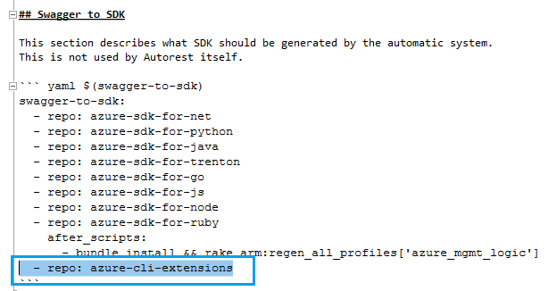

# How to author readme files for CLI CodeGen

It's straight forward to prepare the initial readme files for CLI CodeGen which would contains the configuration to customize CodeGen behavior if needed:

## Step1. Prepare readme.az.md

Create readme.az.md in the same folder of readme.md and copy following content with the {svcName} replaced with proper name

    ## AZ

    These settings apply only when `--az` is specified on the command line.

    ``` yaml $(az)
    az:
        extensions: {svcName}
        namespace: azure.mgmt.{svcName}
        package-name: azure-mgmt-{svcName}
        az-output-folder: $(azure-cli-extension-folder)/src/{svcName}
        python-sdk-output-folder: "$(az-output-folder)/azext_{svcName}/vendored_sdks/{svcName}"
    # add additinal configuration here specific for Azure CLI
    # refer to the faq.md for more details
    ```

## Step2. Prepare readme.cli.md

Create readme.cli.md in the same folder of readme.md with following content. No modification needed.

    ``` yaml
    # add any configuration here for all CLI languages
    # refer to the faq.md for more details
    ```

## Step3. Prepare readme.python.md

If your service has released Python SDK, it's likely you already have the file. If not, you can create readme.python.md in the same folder of readme.md and copy following content with {svcName} replaced properly:

    ## Python

    ```yaml $(python)
    python:
        azure-arm: true
        license-header: MICROSOFT_MIT_NO_VERSION
        namespace: azure.mgmt.{svcName}
        package-name: azure-mgmt-{svcName}
        clear-output-folder: true
    ```

    ``` yaml $(python) && $(python-mode) == 'update'
    python:
        no-namespace-folders: true
        output-folder: $(python-sdks-folder)/{svcName}/azure-mgmt-{svcName}/azure/mgmt/{svcName}
    ```
    ``` yaml $(python) && $(python-mode) == 'create'
    python:
        basic-setup-py: true
        output-folder: $(python-sdks-folder)/{svcName}/azure-mgmt-{svcName}
    ```

## Step4. Update readme.md

Add following highlighted line in readme.md to enable CLI CodeGen in swagger PR:



The readme files should be ready now and you can refer to [here](how-to-generate.md) to generate your CLI code now. 

Feel free to reach to us at amecodegen@microsoft.com if you hit any issues or questions.
