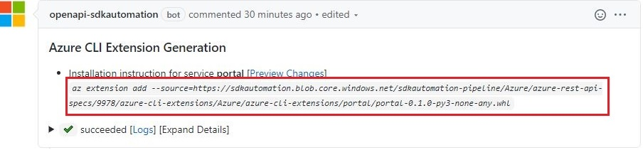
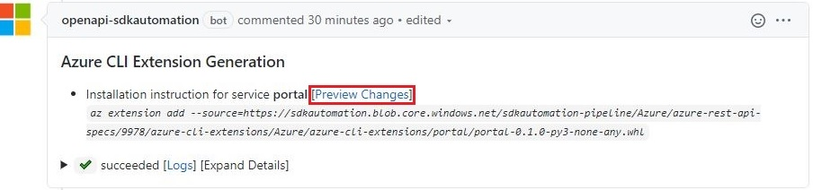
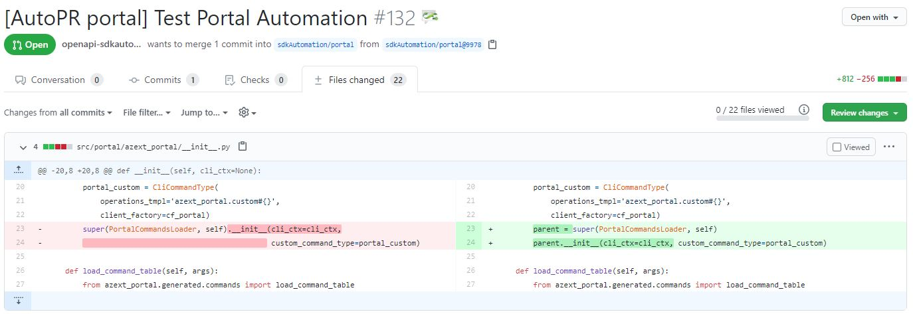
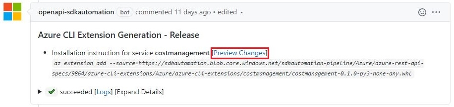
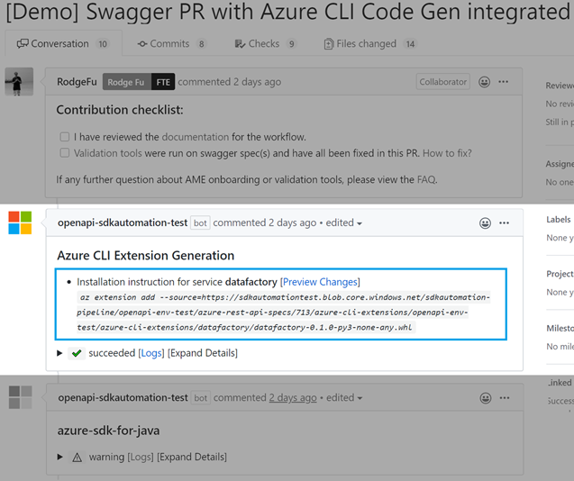
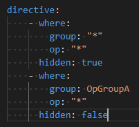
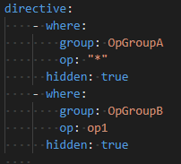

# Background knowledge

Autorest.az supports both Azure CLI main modules generation and Azure CLI extension generation.  

There are 3 approaches to use autorest.az:
* **Swagger** repo pull request
* **Docker**
* **Locally** running autorest command

Note: Azure CLI main modules generation currently doesn't support Swagger PR generation.

## Azure CLI main modules and Azure CLI Extensions

* Azure CLI main modules: is the Azure CLI main modules, it targets https://github.com/Azure/azure-cli repo.
* Azure CLI Extensions: is the Azure CLI extension modules, it targets https://github.com/Azure/azure-cli-extensions repo.  

The difference between Azure CLI main modules and Azure CLI extension is very minimal for customer user experience.  and currently CLI team is trying to migrate all the Azure CLI main repo modules into CLI extensions to keep main modules repo slighter.

**Here're some guidelines before you decide whether you want main modules or CLI extensions and how our CLI code generator can better works:**  

1. If you are working on **a totally new RP or existing RP but has never been onboarded to Azure CLI before**, I would recommend you to use **Azure CLI Extensions** and use CLI code generator i.e. autorest.az to generate the extension.   
1. If you are working on **a RP that was onboarded to Azure CLI before in Azure CLI main modules and you have some new operations you would like to add in Azure CLI** and it's better to use Azure CLI main modules and use CLI code generator to incrementally add the new operations.  
1. If you are working on **a RP that was onboarded to Azure CLI before in either Azure CLI Extensions or Azure CLI main modules but you are okay to replace those manual written code**, it would be better to use our Code Generator to re-generate them all.

# How to generate code using autorest.az

## Through PR in [Swagger repo](https://github.com/Azure/azure-rest-api-specs)

:warning: This approach is only for CLI extension generation.  

Autorest.az has been integrated into the [swagger repo](https://github.com/Azure/azure-rest-api-specs), which means it will be triggered automatically to generate the CLI extension for you without any extra effort as long as the readme files are ready in the swagger repo or PR. Prepare the initial readme file as documented here in [Preparing Readme](how-to-author-readme-file.md). 

The following is code generation step by step:

1. Create the PR in Swagger repo.

2. Try az cli extension. 



3. Review auto generated Az cli extension code. 





4. Modify and Merge

    a. If nothing needs to be changed after review, merge the swagger PR. After the swagger PR is merged, another PR target to [Az cli extension](https://github.com/Azure/azure-cli-extensions) will be created but marked as closed. Following the link in pipeline, find the PR for Az cli extension, reopen it and ask for code review.

    

    b. If you want to change Az cli auto generated code, please pull the Az cli extension PR to local, which you reviewed in step 2.

    

    You can change the cli code and test locally with [developing guideline](https://github.com/Azure/azure-cli/blob/dev/doc/configuring_your_machine.md). After completed, please create the Az cli extension PR target to [Az cli extension](https://github.com/Azure/azure-cli-extensions) directly.

More detail can also be found in this [video](https://msit.microsoftstream.com/video/71cea3ff-0400-a9f4-01b4-f1ea9e9b130e)



## Through Docker

We have pre-prepared docker image for you to use autorest.az easily. (Please make sure [Docker](https://www.docker.com/products) has been installed. :))

1. Start docker:
    * sync 'https://github.com/Azure/azure-rest-api-specs.git' to {swagger_folder}
    * sync 'https://github.com/Azure/azure-cli-extensions.git' to {azure_cli_ext_folder} or 'https://github.com/Azure/azure-cli.git' to {azure_cli_folder}
    * login to Azure Container Registry and start the docker
    ``` bash
    > az acr login --name amecodegen
    if it's for Azure CLI Extensions generation.
    > docker run -v {swagger_folder}:/home/swg -v {azure_cli_ext_folder}:/home/azext -it amecodegen.azurecr.io/az:2020.05.24 /bin/bash
    if it's for Azure CLI main modules generation.
    > docker run -v {swagger_folder}:/home/swg -v {azure_cli_folder}:/home/azcli -it amecodegen.azurecr.io/az:2020.05.24 /bin/bash
    ```

2. Generate the code:
    * Make sure the readme files are ready in the swagger repo. We can help to prepare the init readme files for you as mentioned in [onboarding-guide](onboarding-guide.md), or you can also find example [here](../src/test/scenarios/attestation/configuration).
    * Generate the code:  
        if it's for Azure CLI Extensions:  
        ``` bash
        > autorest --az --azure-cli-extension-folder=/home/azext /home/swg/specification/{service_name}/resource-manager/readme.md
        ```
        if it's for Azure CLI main repo modules:  
        ``` bash
        > autorest --az --target-mode=core --azure-cli-folder=/home/azcli /home/swg/specification/{service_name}/resource-manager/readme.md
        ```

3. Run the generated command
    * Generated commands are ready to use after adding the extension:  
        If it's for Azure CLI Extensions.  
        ``` bash
        > azdev extension add {service_name}
        # your command is ready to use now
        ```
        If it's for Azure CLI main repo modules, then there's nothing more needed.

4. Run generated test cases and style check
    * run azdev test
    ``` bash
    > azdev test {service_name}
    ```

    * run azdev linter
    ``` bash
    > azdev linter {service_name}
    ```

    * run azdev style
    ``` bash
    > azdev style {service_name}
    ```

## Through autorest command directly in local
1. Make sure your environment is good to run autorest and autorest.python by following [this](https://github.com/Azure/autorest.python/wiki/Generating-with-autorest-for-python-v5.0.0).
1. sync 'https://github.com/Azure/azure-rest-api-specs.git' to {swagger_folder} 
1. sync 'https://github.com/Azure/azure-cli-extensions.git' to {azure_cli_ext_folder} or 'https://github.com/Azure/azure-cli.git' to {azure_cli_folder} if you are working on Azure CLI main modules generation.
1. Generate the code:
    * Make sure the readme files are ready in the swagger repo. To prepare the initial readme file, please following [Preparing Readme](how-to-author-readme-file.md).
    * Generate the code:  
        if it's for Azure CLI Extensions generation:  
        ``` bash
        > autorest --az --azure-cli-extension-folder={azure_cli_ext_folder} {swagger_folder}/specification/{service_name}/resource-manager/readme.md
        ```
        if it's for Azure CLI main modules generation:  
        ``` bash
        > autorest --az --target-mode=core --azure-cli-folder={azure_cli_folder} {swagger_folder}/specification/{service_name}/resource-manager/readme.md
        ```

1. Run the generated command  
   :warning: This step is only needed for Azure CLI Extensions generation.
    * Build az extension from the generated code and load it in az
    ``` bash
    # run this in the folder with generated code: {azure_cli_ext_folder}/src/{service_name}
    > python setup.py sdist bdist_wheel
    > az extension add --source={azure_cli_ext_folder}/src/{service_name}/dist/{generated .whl file}
    # your az command is ready to use :)
    ```
1. Run the generated test
    * Follow the [guidance](https://github.com/Azure/azure-cli/blob/dev/doc/authoring_tests.md) from azure-cli for running test.

1. Run linter and style check
    * Follow the [guidance](https://github.com/Azure/azure-cli/blob/dev/doc/configuring_your_machine.md#running-tests-and-checking-code-style) to run linter and style check.


## Full and Incremental.
In both Azure CLI main modules or Azure CLI Extensions generation, CLI Code Generator also supports two generation mode: full and incremental. 

* Full: generates all the operations/apis defined in the input rest api specs for that RP.  
* Incremental: generates several specific operations that you have configured in readme files.  

In incremental generation, we will put our generated code into a generated folder in your modules code folder and the only change for existing code is to add import logic in very few places so that the code in generated folder can be loaded by CLI commands loader.  

### Incremental codegen configuration:
1. Readme: Besides following [Preparing Readme](how-to-author-readme-file.md). Incremental mode needs to be configured in the Readme.az.md file. There are two ways to configure incremental mode:  
    * **Allow list** hide all commands by setting hidden to true. Then unhide the command groups or commands to be generated:

      
    * **Deny list** make all commands visible and hide the command groups or commands to not be generated:

      

2. As autorest.az supports auto detect full/incremental generation mode:  
    * If the cli extention folder for target RP is empty or the code was generated by autorest.az before, then full code generation mode will be run.
    * If the cli extention folder for target RP is not empty and the code was manually written before, incremental code generation mode will be run.

Normally you don't need to care about the generation mode, because the code generator will automatically add the import logic if it found code already exists. and what operations will be generated is determined by the Readme **allow list** or **deny list**   

But you can still add `--generation-mode=full` or `--generation-mode=incremental` to force full/incremental code generation during both Azure CLI main modules generation or Azure CLI extension generation: 
  ``` bash
 > autorest --az --azure-cli-extension-folder={azure_cli_ext_folder} --generation-mode=full {swagger_folder}/specification/{service_name}/resource-manager/readme.md
 ```
 or 
   ``` bash
 > autorest --az --target-mode=core --azure-cli-folder={azure_cli_folder} --generation-mode=incremental {swagger_folder}/specification/{service_name}/resource-manager/readme.md
 ```
